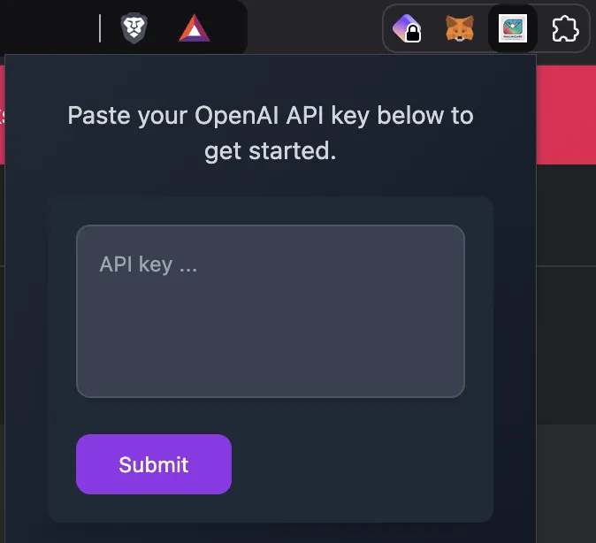
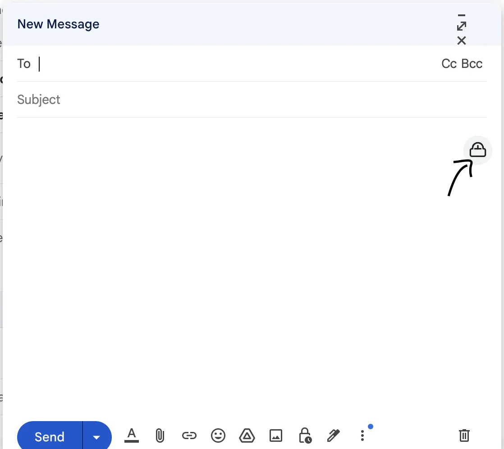
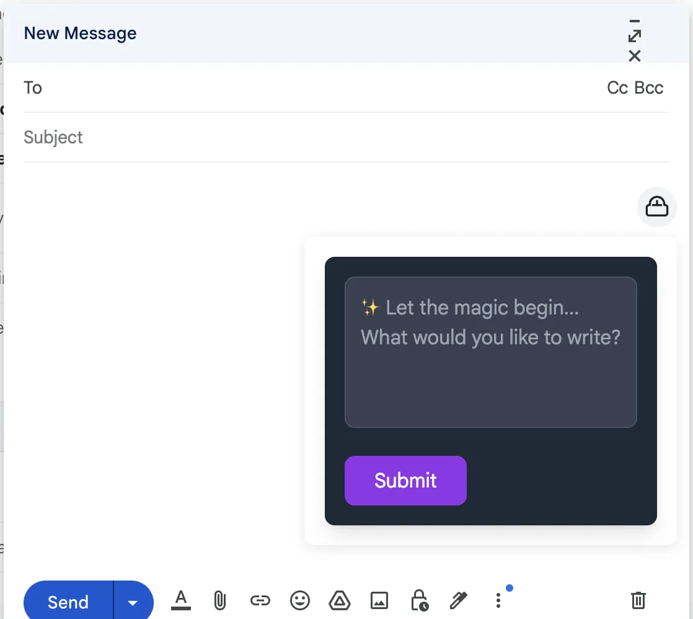
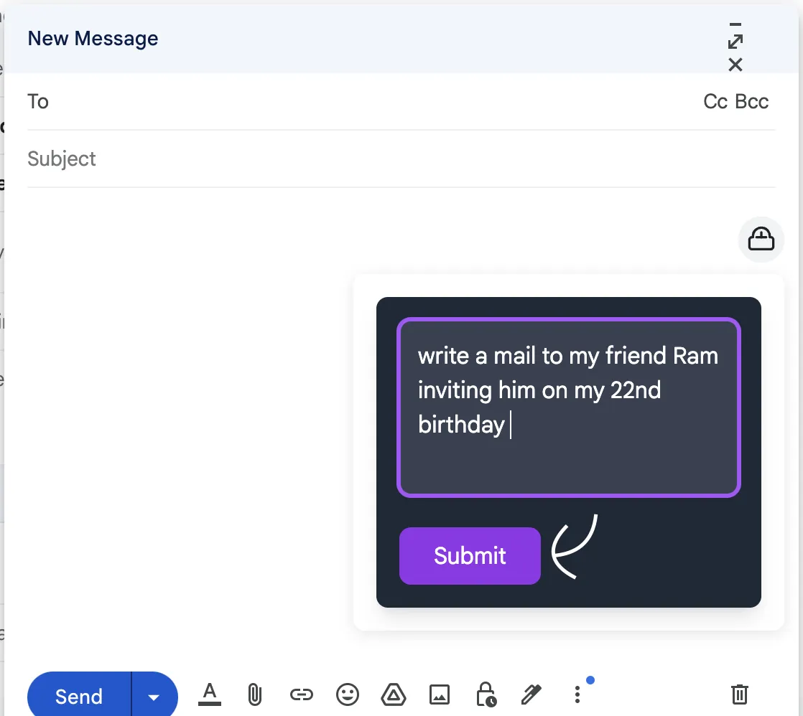
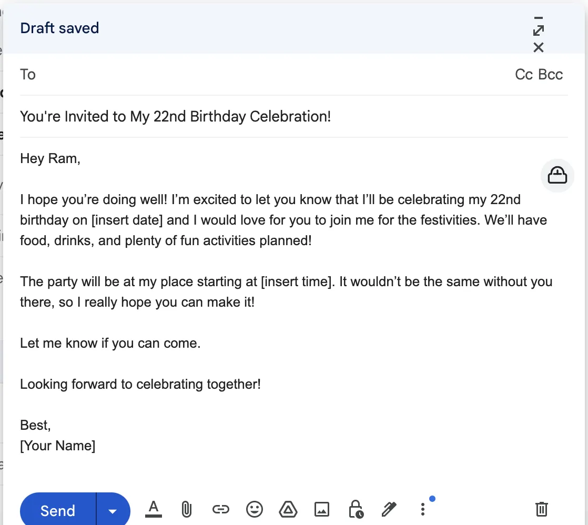

<div align="center">
  
  <h1>
    
  </h1>
  <p>
    
    
    
    <br/>
    <i>Transform your email composition with AI-powered suggestions!</i>
  </p>
</div>

---

<div align="center">
  <h3>🚀 Features</h3>
</div>

<div align="center">
  <table>
    <tr>
      <td align="center">🔑</td>
      <td>Simple OpenAI API key setup</td>
      <td align="center">🎯</td>
      <td>Seamless Gmail integration</td>
    </tr>
    <tr>
      <td align="center">💡</td>
      <td>AI-powered email generation</td>
      <td align="center">⚡</td>
      <td>Instant email drafting</td>
    </tr>
    <tr>
      <td align="center">🔒</td>
      <td>Secure API key storage</td>
      <td align="center">✨</td>
      <td>User-friendly interface</td>
    </tr>
  </table>
</div>

---

<div align="center">
  <h3>⚙️ Installation</h3>
</div>

<div align="left">

1. Clone the repository:
```bash
git clone https://github.com/yourusername/mailwizard.git
cd mailwizard
```

2. Install dependencies:
```bash
npm install
```

3. Build the extension:
```bash
npm run build
```

4. Load the extension in your browser:
   - Open Chrome/Browser and navigate to `chrome://extensions`
   - Enable "Developer mode" in the top right
   - Click "Load unpacked"
   - Select the `dist` folder from the project directory
</div>

---

<div align="center">
  <h3>📱 Usage</h3>
</div>

<div align="left">

1. After installation, click on the MailWizard extension icon in your browser
2. Enter your OpenAI API key in the popup window
3. Open Gmail and click "Compose" to start a new email
4. Click the AI icon in the compose window's toolbar
5. Enter your prompt describing the email you want to generate
6. Click "Submit" to generate your email
7. The generated email will automatically populate in your compose window
</div>

---

<div align="center">
  <h3>📸 Screenshots</h3>
</div>
<div align="center">
  <details>
    <summary><b>API Key Setup</b></summary>
    
    <p><i>Extension popup for setting up your OpenAI API key</i></p>
  </details>
  <details>
    <summary><b>Email Compose Integration</b></summary>
    
    <p><i>AI icon integrated into Gmail's compose window</i></p>
  </details>
  <details>
    <summary><b>AI Prompt Interface</b></summary>
    
    <p><i>Interface for entering your email generation prompt</i></p>
  </details>
  <details>
    <summary><b>Example Usage</b></summary>
    
    <p><i>Example of entering a prompt for birthday invitation</i></p>
  </details>
  <details>
    <summary><b>Generated Email</b></summary>
    
    <p><i>Examplex of an automatically generated email</i></p>
  </details>
</div>

---

<div align="center">
  <h3>🛠️ Technical Requirements</h3>
</div>

<div align="center">
  <table>
    <tr>
      <td align="center">📦</td>
      <td>Node.js and npm</td>
    </tr>
    <tr>
      <td align="center">🌐</td>
      <td>Chrome, Firefox, or other compatible browser</td>
    </tr>
    <tr>
      <td align="center">🔑</td>
      <td>OpenAI API key</td>
    </tr>
  </table>
</div>

---

<div align="center">
  <h3>🔒 Security Note</h3>
</div>

<div align="left">

Your OpenAI API key is stored securely in the browser's local storage. Always keep your API key private and never share it with others.
</div>

---

<div align="center">
  <h3>📄 License</h3>
</div>

<div align="left">

This project is licensed under the MIT License - see the LICENSE file for details
</div>

---

<div align="center">
  <h3>📫 Contact</h3>
</div>

<div align="center">
  <a href="https://github.com/Anish-Gupta1">
    
  </a>
  <br/>
  <br/>
  <i>Project Link: <a href="https://github.com/yourusername/mailwizard">https://github.com/yourusername/mailwizard</a></i>
</div>
